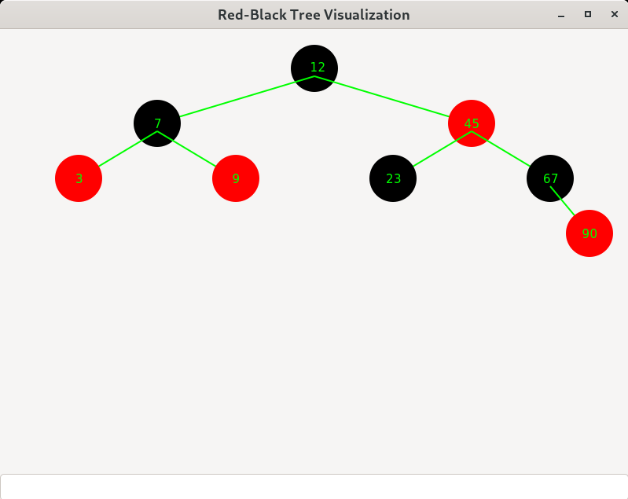

# Red-Black-Tree-Visualization
The program is a visualizer for operations on a Red-Black tree.

## Introduction to Red-Black Trees
A red-black tree is a binary search tree with one extra bit of storage per node: its color, which can be either RED or BLACK. By constraining the node colors on any simple path from the root to a leaf, red-black trees ensure that no such path is more than twice as long as any other, so that the tree is approximately balanced. 

Because of this color property, the height of a red-black tree with $`n`$ keys is at most $`2log(n+1)`$ which is $`O(log(n))`$. Further, insertion, searching, and deletion have a worst case time complexity of $`O(log(n))`$ on red-black trees, whereas those operations take $`O(n)`$ time on binary search trees.

The following functions have been implented in the `red_black_tree.c` file:

| Name | Complexity | Purpose |
| -------- | ------- | ------- | 
| initializeTree() | O(1) | Initializes an empty tree. |
| leftRotate() | O(1) | Performs a left rotation on the given node. |
| rightRoate() | O(1) | Performs a right rotation on the given node. |
| rbInsert() | O(log(n)) | Inserts a new node with the given data into the tree. |
| rbInsertFixup() | O(log(n)) | Fixes any color or structural violations after insertion. |
| rbMaximum() | O(log(n)) | Returns the node with the maximum value. |
| rbMinimum() | O(log(n)) | Returns the node with the minimum value. |
| rbTransplant() | O(1) | Replaces a subtree with a subtree rooted at a different point. |
| rbDelete() | O(log(n)) | Deletes a node with the given data from the tree. |
| rbDeleteFixup() | O(log(n)) | Fixes any color and structural violations after deletion. |
| destroyTree() | O(n) | Calls destroyTreeHelper() and frees the root. |
| destroyTreeHelper() | O(n) | Recursively frees a node and the node's subtree. |
| isBlack() | O(1) | Finds if a given node is BLACK. |
| isRed() | O(1) | Finds if a given node is RED. |
| findColor() | O(1) | Returns the color of a given node. |
| height() | O(n) | Returns the largest number of edges from a given node to a leaf. |
| size() | O(n) | Returns the number nodes in a given subtree. |
| isEmprty() | O(1) | Finds if a given tree is empty (root = nil). |

## Visualization
The visualizer uses GTK3 for the GUI, so GTK3 will need to be installed on your system in order for the program to run. The bottom text box is where numbers are entered to be inserted. Currently, the program only visualizes the state of the tree after each insertion. In the future, there are plans to allow visualization of the other operations, as well showing the intermediate steps of each operation.

To compile the program with GCC, I suggest using the following command: gcc ./src/*.c -I./src `pkg-config --cflags --libs gtk+-3.0`
